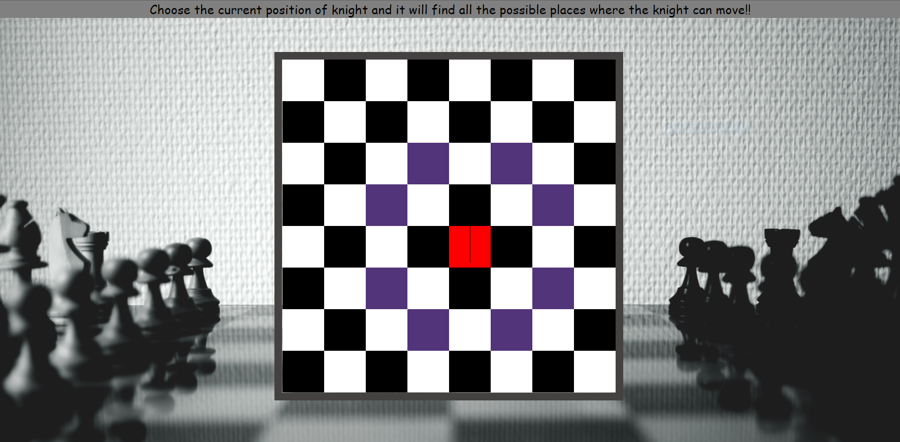

Getting started with this app  
Install all the required dependencies as well as add all th ext CDN. 
run this command on command line i.e npm start. 
Click on any position of chessboard. 
The clicked position will turn to be in red background. 
Then the relative position from that current position where knight can move will be highlighted using blue background colour.
